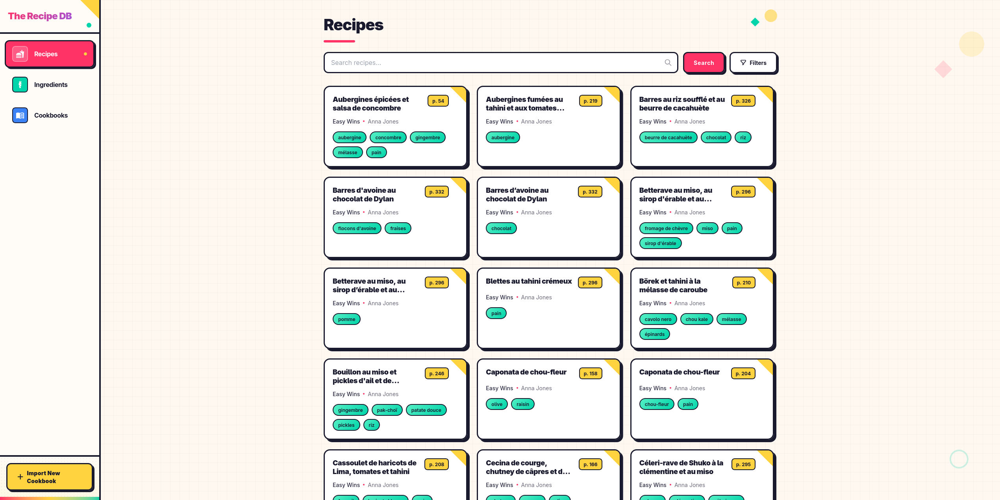

# the-recipe-db

A recipe database application that allows users to import cookbook index pages via OCR, extract and store recipes with
their ingredients, and search recipes by name, ingredient, or cookbook.



## Tech Stack

- **Backend**: Java 21, Quarkus 3.30.5
- **Database**: PostgreSQL
- **ORM**: Hibernate ORM with Panache
- **Migrations**: Flyway
- **AI/OCR**: LangChain4j + OpenAI
- **Frontend**: Vue 3, TypeScript, Vite, Tailwind CSS 4

## Prerequisites

- Java 21+
- Docker (for PostgreSQL via Dev Services in development)

## Development

```bash
./mvnw quarkus:dev
```

This starts:

- Backend at http://localhost:8080
- Swagger UI at http://localhost:8080/q/swagger-ui
- Dev UI at http://localhost:8080/q/dev

PostgreSQL is automatically started via Quarkus Dev Services.

## Environment Variables

The following environment variables are required for production:

| Variable                             | Description                                                            |
|--------------------------------------|------------------------------------------------------------------------|
| `QUARKUS_DATASOURCE_JDBC_URL`        | PostgreSQL connection URL (e.g., `jdbc:postgresql://host:5432/dbname`) |
| `QUARKUS_LANGCHAIN4J_OPENAI_API_KEY` | OpenAI API key for AI/OCR features                                     |

## Running in Production

```bash
./mvnw package
java -jar target/quarkus-app/quarkus-run.jar
```

## Tests

```bash
./mvnw test
```
